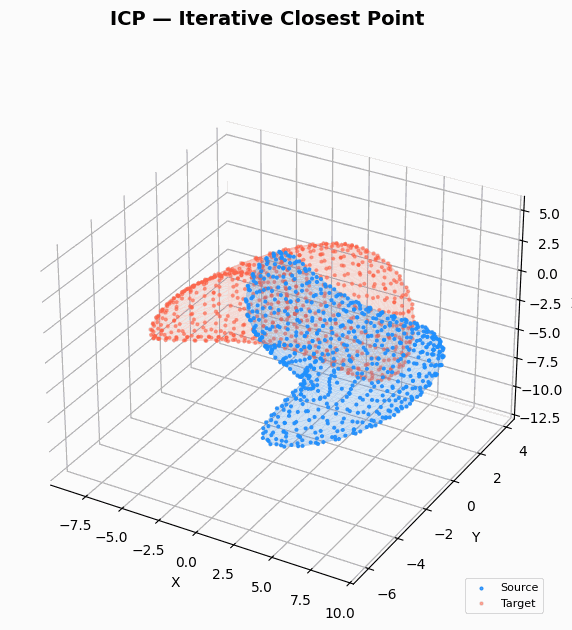

# ICP — Iterative Closest Point Visualizer

A pure Python implementation of the Iterative Closest Point algorithm with real-time 3D visualization.



## How It Works

Each ICP iteration:

1. **Find correspondences** — for each source point, find its nearest neighbor in the target cloud
2. **Compute transform** — SVD on matched pairs → optimal rotation **R** + translation **t**
3. **Apply transform** — move source points by `R · p + t`
4. **Check convergence** — stop when mean error change drops below tolerance

| Color | Meaning |
|-------|---------|
| 🔵 **Blue** | Source cloud (being aligned) |
| 🔴 **Red** | Target cloud (reference) |

> [!NOTE]
> ICP performs best when the two meshes are **roughly aligned** to begin with. A purely random initial position can cause the algorithm to converge to a **local minimum**, it finds an inflection point at the wrong orientation and stops there. This is a known limitation of vanilla ICP; in practice, a coarse initial alignment (manual or automated) is applied first.

## Build

**Prerequisites:** Git, Python 3.

```bash
# 1. Clone the project
git clone https://github.com/Loammm/ICP.git
cd ICP

# 2. Install dependencies
pip install -r requirements.txt

# 3. Run locally
python main.py
```
